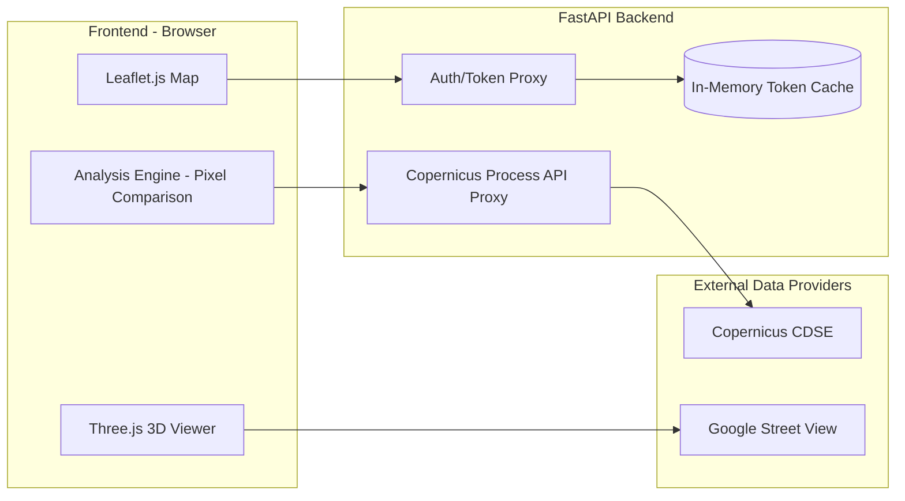
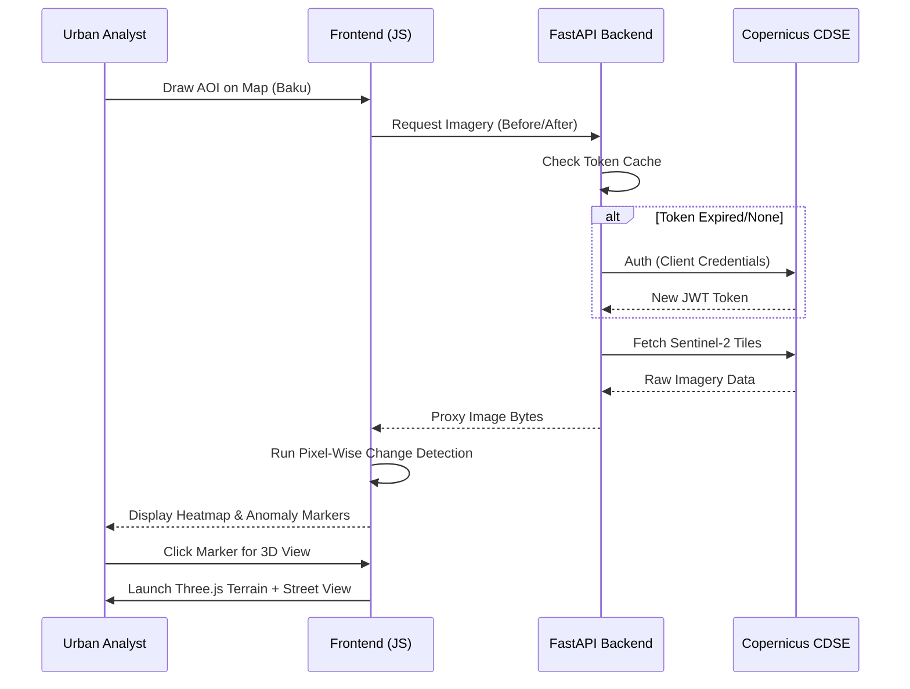
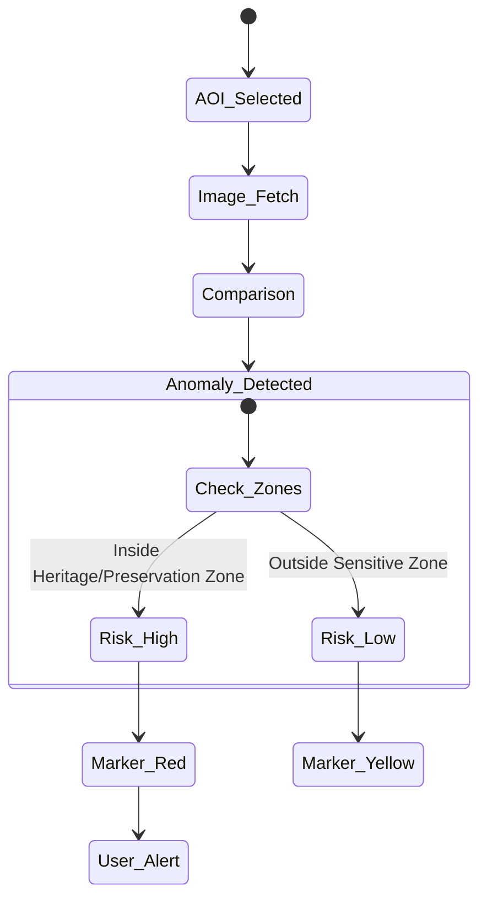

# 🌍 Urban Anomaly Detection System
### *AI-Assisted Satellite Imagery Analysis for Urban Preservation*

This project is an end-to-end solution for detecting urban changes and preservation risks using **Copernicus Sentinel-2** satellite data. Specifically optimized for the Baku region, it transforms raw spectral data into actionable insights through a seamless 2D/3D visualization interface.

---

## 🚀 Vision
Cities evolve rapidly. Distinguishing between planned development and unauthorized anomalies that threaten environmental or historical heritage is critical. Our system automates this by performing time-series analysis on satellite imagery to visualize changes in seconds.

---

## 🏗️ Architectural Overview

The system utilizes a **Decoupled Client-Server Architecture** to optimize security and performance. The backend acts as a secure "Gatekeeper" and Proxy, while the frontend handles heavy lifting for image processing and 3D rendering.




---

## 🛠️ Technical Stack

### 🔹 Backend (Python & FastAPI)
- **Security:** Obfuscates Copernicus `client_secret` from the client-side.
- **Token Management:** Implements an in-memory caching strategy to reuse access tokens until expiry, drastically reducing latency.
- **Router Pattern:** Standardized `/api/v1` structure for scalable endpoint management.

### 🔹 Frontend (JavaScript & Geospatial)
- **Mapping:** **Leaflet.js** for high-performance 2D map interaction and AOI (Area of Interest) drawing.
- **Change Detection:** Custom `analysis.js` logic that compares multi-temporal pixels to identify clusters of change.
- **Visualization:** A hybrid approach using **Three.js** for 3D terrain and **Google Street View** for ground-truth verification.

---

## 🔄 Core Workflow (Sequence Diagram)

The journey from initial AOI selection to 3D anomaly validation:




---

## 📊 Decision Logic (Activity Diagram)

Not every change is a "risk." The system intelligently filters anomalies based on predefined preservation zones.



---

## 💻 Setup & Installation

### Backend
```bash
cd backend
python -m venv venv
source venv/bin/activate
pip install -r requirements.txt
# Configure .env with CDSE_CLIENT_ID and CDSE_CLIENT_SECRET
uvicorn app.main:app --reload
```

### Frontend
The frontend is a static web application. Update the `API_BASE_URL` in `config.js` to point to your backend, then serve using any static web server (e.g., Live Server or Nginx).

---

*Developed for the Urban Innovation Hackathon 2026.*
